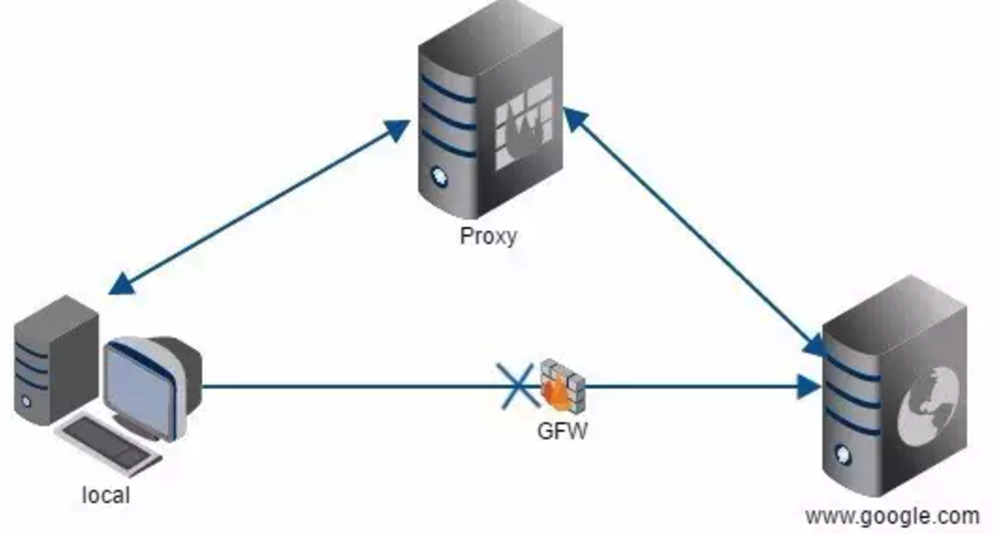
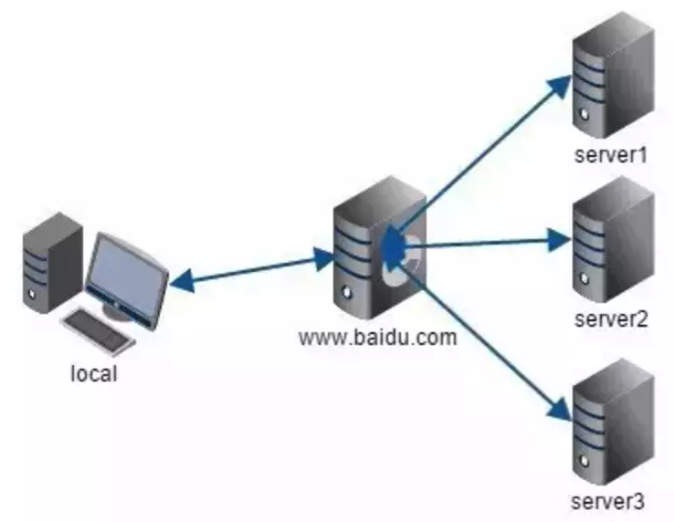

# 代理和反向代理

-------
有没有一些时候，傻傻分不清楚代理和反向代理？今天通过两个小例子来说明白这件事儿～

## 什么是代理？

在唐朝，杨黑娃远在长安打工谋生，想给远在家乡的暗恋对象王二丫写一封情书(我们暂且认为情书是匿名的)。而同乡狗贩子的李狗蛋经常往返与家乡和长安之间，于是杨黑娃找到李狗蛋，让他帮忙带信给王二丫。

在这个例子中，杨黑娃(客户端)不能直接联系到王二丫(服务器)，于是找到一个能帮他联系到王二丫的李狗蛋(代理服务器)。因为信是匿名的，所以王二丫以为情书是李狗蛋写的，长期以往，王二丫终于和李狗蛋在一起了！(这是个悲伤的故事)

## 代理的流程是这样的

* 客户端请求代理服务器
* 代理服务器请求原始服务器
* 原始服务器给代理服务器响应
* 代理服务器给客户端响应

## 代理特性

* 需要设置，(找到李二狗)
* 原始服务器不知道真正的访问者，对于访问者来说具有隐匿效果。(于是王二丫和李狗蛋在一起了)
* 访问者和代理需要在同一个网络下，(黑娃可以找到二狗)

## 代理适用的场景

* 架上梯子，翻过墙，为所欲为
* 绕过资源检查，防盗链

-------

## 什么是反向代理？

伤心欲绝的杨黑娃到酒馆畅饮3000杯！于是命店小二上最好的菜，最烈的酒。

在这个例子中，店小二获取到了杨黑娃要酒要菜的需求，于是火速上货。对于黑娃来讲，他不关心菜是谁做的，酒是通过什么渠道来的。都最后都是经店小二的手给了自己反馈。

## 反代理的流程是这样的

* 客户端发送请求给服务器
* 服务器通过自己内部的配置，作出对应的响应 

## 特性

* 不需要设置，(直接找店小二说)
* 客户访问时是无感的，对于服务器内部来说，可操作空间变大，更安全(黑娃只是吃到了菜，但是并不知道菜到底时谁做的)

## 适用场景

* 保护，隐匿原始服务器地址或端口
* 负载均衡

