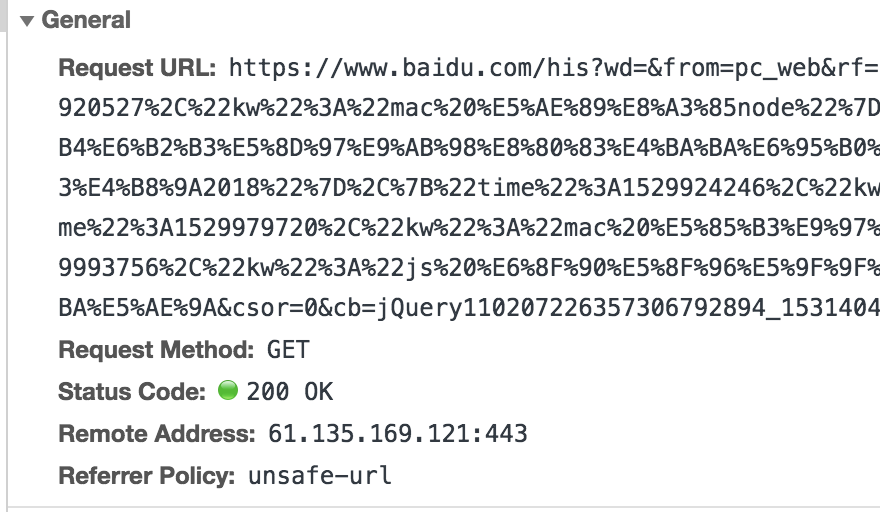

### 一个请求中都包含了什么？
-------

### 请求概览信息，以下图为例 General

* Request URL
    * 说明: 请求地址
    * 默认值: 无
    * 数据类型: String

* Request Method
    * 说明: 请求类型
    * 默认值: 无
    * 可选参数: GET,POST,PUT,DELETE,HEAD,CONNECT,OPTIONS,TRACE,PATCH
    * 数据类型: String
    * 备注: GET=获取，POST=提价，PUT=更新，DELETE=删除，HEAD=请求资源头，CONNECT=链接，OPTIONS=获取资源支持的请求，TRACE=测试，PATCH=修改部分，详情参考[关于Api设计的一些见解](./api-architecture.md) 

* Status Code
    * 说明: 请求状态码
    * 默认值: 无
    * 数据类型: Number
    * 备注: [你和服务器的交往日常](./response-status-codes.md)

* Remote Address
    * 说明: 请求服务器的IP和端口
    * 默认值: 无
    * 数据类型: String

* Referrer Policy 
    * 说明: 监管访问来源信息，指定请求头中Refere应该被包含的字段
    * 默认值: no-referrer-when-downgrade
    * 数据类型: String
    * 可选参数: no-referrer,no-referrer-when-downgrade,origin,origin-when-cross-origin,same-origin,strict-origin,strict-origin-when-cross-origin,unsafe-url
    * 备注: 具体类型参考[Referrer-Policy](https://developer.mozilla.org/zh-CN/docs/Web/HTTP/Headers/Referrer-Policy)

### 服务器响应头 Response headers

* Accept
    * 说明: 告知服务器处理所的内容类型，使用 Content-Type 应答头通知客户端它的选择
    * 默认值: 无
    * 数据类型: String

* Accept
    * 说明: 告知服务器处理所的内容类型，使用 Content-Type 应答头通知客户端它的选择
    * 默认值: 无
    * 数据类型: String
