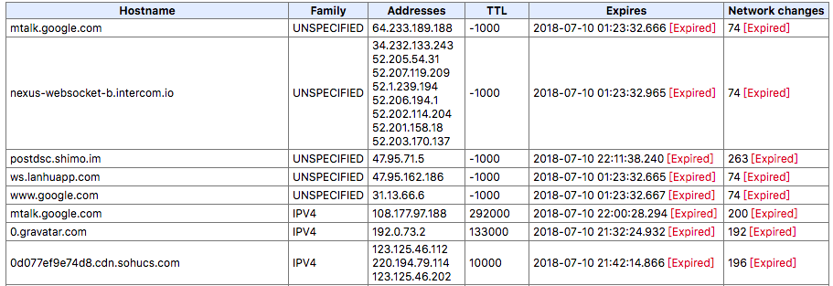

### 一个网络请求都经历了什么？
-------

### a.当你想发一个请求
首先，在浏览器端，无论你用到了什么样的请求库(Jquery.ajax, axios)，到最后都是调用了 `window.XMLHttpRequest`,然后这个忠实的士兵，去报告浏览器长官说，我收到了一个`http://dev.yuelao.com/get-girfriend`的请求(假设是这个地址)。然后浏览器对士兵说，这是这个人要找一个名称叫做月老`(dev.yuelao.com)`的人，然后问他要一个女朋友`(/get-girfriend)`。但是我们只知道他的名字叫月老，想要找到他具体在哪里，这得知道他家`(IP地址)`在哪儿才行。你在这里等我，我去找找他家在哪儿。

### b. 找到月老的家(域名解析)
* 1. 浏览器长官先尝试在自己的小本本(dns缓存)中看看能不能找到这个名字叫月老的家伙，如果有，那么直接返回对应的IP地址。

::: warning
浏览器的dns缓存的有效时间都很短，谷歌表示，只能坚持60秒。
谷歌浏览器dns缓存查看,地址栏输入`chrome://net-internals/#dns`
:::

* 2. 在小本本中没有找到月老？那看看系统中hosts记账中是否有月老名称的映射，如果有，那么返回对应的IP地址。
    
* 3. 还是没有找到月老的家？那看看系统的DNS缓存中有没有，如果有，直接返回对应的IP，
    
* 4. 还是没有，那么就浏览器长官只能去当地派出所(本地配置DNS服务器)查询了

    * 4-1. 派出所先看看查看本地居民册(DNS的服务器缓存)中有没有这个名字叫做月老的人，如果有，那么直接返回IP
        
    * 4-2. 嗯，月老看来是个外乡人，看看其他派出所的系统里面是否有这个人。于是当地派出所(本地配置的DNS解析服务器)会请求其他派出所，看看能不能找到月老的下落。
        
    * 4-3. 还是没有找到？这个人好神秘，看来得动用暗势力了，亚洲公安总局(根服务器)！于是在亚洲总局中搜索这个叫做月老的家伙，如果有那么返回
        
    * 4-4. 还是可没有找到(心中有句MMP不知当讲不当讲)？于是，亚洲公安总局分别向其他大洲的总局发出请求，都尼玛帮老子找找这个叫做月老的家伙！若是还没有，说明月老的是神话中(不存在)的人物。到此，宣告没有找到这个人，那么你想要跟月老找女友的事情一定是黄了，看来注定要孤老终身！。

### c. 历经千辛万苦终于找到了月老家？别着急问他要女朋友，先看看这到底是不是月老家！于是开始新一轮的认证，建立TCP链接
* B1. (浏览器以已1024 < 随机端口 < 65535，向IP对应服务器的80端口发起这个TCP请求)，然后开始下面的对话(TCP协议，三次握手)
* B1-1. 你：请问这是月老家么？浏览器发送一个试探性的请求，同时传递`ACK = 0,SYN = 1,seq = x`给服务器,这几个参数分别表示：`ACK = 0,SYN = 1`这是一个连接请求报文(我就问问)；`seq = x`浏览器请求的初始序号（这是浏览器第几次请求）。这个时候浏览器进入syn_sent装套，等待服务器给回复
        
* B1-2. 月老：是谁？在我睡午觉的时候打扰我？同时返回`ACK = 1,SYN = 1,seq = y, ack = x + 1`,这几个参数分别表示：`ACK = 1,SYN = 1`这是个有效请求(我还活着且听到了你的召唤);`seq = y`服务器请求的初始序号（这是浏览器第几次请求）；`ack = x + 1`服务器给浏览器请求包的值(相应浏览器的x次请求)；这时，服务器进入syn_rcvd状态，等待浏览器给恢复
        
* B1-3. 你：大哥，自己人，别开枪！同时传递`ACK = 1,SYN = 1,seq = y + 1`给服务器，这些参数表示，`ACK = 1,SYN = 1`这是个有效请求(小弟听到了大哥的话)；`seq = y + 1`浏览器给服务器请求包的值(相应服务器的Y次请求)
        
* B1-4.4 现在双方都确定了对方的存在

### d. 终于可以问问月老，可不可以给一个女盆友！TCP连接后发起http请求
* 你：月老，我想要一个女朋友！
* 月老：终于等到你！给，送个你一个林志玲版的女朋友，不用充气的那种！

### e. 刚刚C中的对话，是来自一个屌丝的幻想！具体他们俩说了什么，看下一章～一个请求中都包含了什么～

### 小结
浏览器发出请求之前，需要先经历DNS解析，拿到server对应的IP地址，然后建立TCP链接，经过三次握手协议，确定请求可以正常发出。