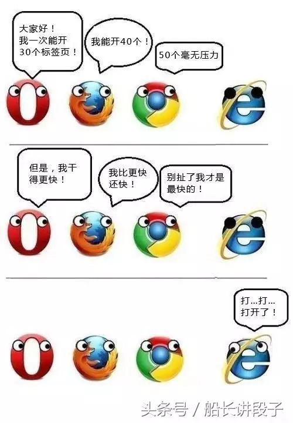

### 浏览器请求限制
-------
专家说，刚烧开的水不能直接喝，因为会烫嘴！哈哈，想到这个这个笑话就想笑，不过还是想说，凡事都有度。一个人最胖的体重，老司机最快的速度，拳手能击打最硬的物体。为啥不更粗更长更硬？因为会出人命！

同样，在浏览器环境中，一个请求也是被限制的，因为质量，因为安全……

#### get请求最大限制(url最长限制)
|borwser|ie|firefox|chrome|safari|opera|
|:---|-----|---|---|---|---:|
|size(字符)|2803|65536|8182|80000|190000|

#### post body最大限制
|borwser|ie|firefox|chrome|safari|opera|
|:---|-----|---|---|---|---:|
|size(GB)|2|2|4|不知道|4|

::: warning
请求的url都受url最大限制；
post的请求是否能成功，还受服务器最大限制，如nginx会对上传最大文件做限制
:::

#### cookie最大限制
|borwser|ie8-|ie8+|firefox3.6-|firefox3.6+|chrome8-|chrome9+|safari|opera10-|opera10+|
|:---|-----|----|---|---|---|---|---|---|--|---:|
|个数|20|50|50|150|70|180|600|30|60|
|size(bytes)|4096|4096|4097|4097|4096|4096|4096|4096|4096|

#### headers最大限制
|frame|apache|nginx|iis|tomcat|
|:---|-----|---|---|---:|
|size(k)|8|4-8|8-16|8-48|

::: warning
header在http中是没有最大限制的，但是服务层会有限制。特别注意的是，当一个header的size大于服务器最大值时，会导致请求失败。（一般是cookie导致的原因居多，清一下cookie能解决）
:::

#### 请求最大并发量
|borwser|ie7|ie8|ie10|firefox2|firefox3+|chrome|safari3|safari5|opera9|opera12|
|:---|---|---|---|--|---|----|----|---|-----|---|----|---:|
|number|2|6|8|2|6|6|4|6|4|6|

::: warning
这里说的并发量，是指同一时间，对单个域名下的请求最大次数限制
:::

#### 安全限制
* 同源策略，XMLHttpRequest不允许请求本域外的地址。跨域的主要原因，[跨域方案,了解一下](./cross-domain/index.md)。

#### 最后，按照惯例，吐槽一下浏览器

