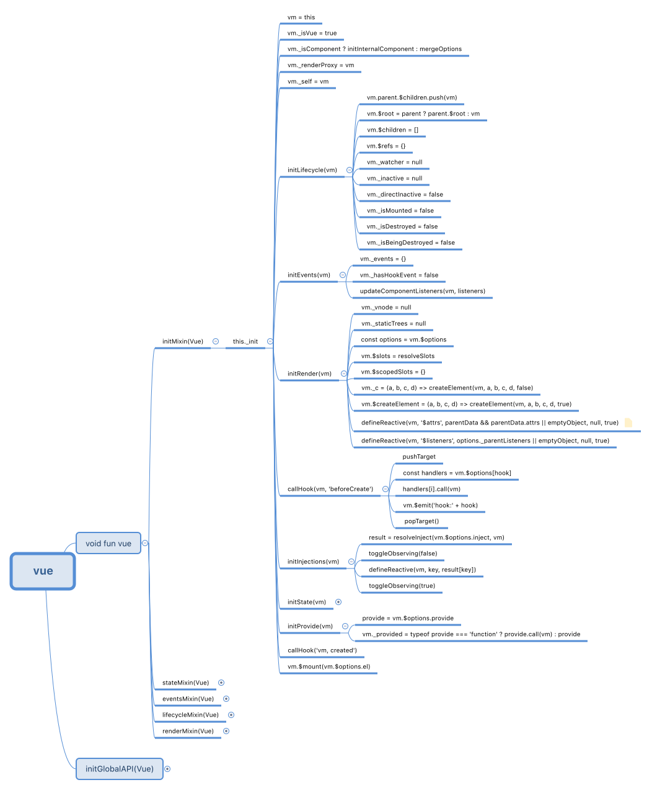

### 理解内部状态前的准备
在使用`vue`的时候，一边感叹他的强大，一边心存疑惑
* `vue`的数据监听是怎么实现的？
* `vue`数据之间的依赖是如何管理的？

理解`vue`内部的数据绑定机制，对我们使用和开发有着至关重要的作用，带着这样的疑问，进入今天的话题

#### Dep
`Dep`订阅发布的构造函数  
[什么订阅发布模式？](../design-patterns/observer.md)
``` js
// core/observer/dep.js
let uid = 0

// 订阅发布
export default class Dep {
  static target: ?Watcher;
  id: number;
  subs: Array<Watcher>;

  constructor () {
    // 维护Id
    this.id = uid++
    // 当前已经订阅的队列，这个数组里面，其实是一个个watcher实例
    this.subs = []
  }

  // 添加订阅队列
  addSub (sub: Watcher) {
    this.subs.push(sub)
  }

  // 移除订阅队列中的某一个
  removeSub (sub: Watcher) {
    remove(this.subs, sub)
  }

  // 依赖
  depend () {
    // 当前实例依赖target,target是一个watcher实例
    if (Dep.target) {
      Dep.target.addDep(this)
    }
  }

  // 发布
  notify () {
    // 固定需要通知的队列，以免在发布过程中通知队列发生改变
    const subs = this.subs.slice()
    // 循环遍历
    for (let i = 0, l = subs.length; i < l; i++) {
      // 调用每一个watcher实例的update方法
      subs[i].update()
    }
  }
}

/**
 * 当前正在操作(设定)的观察者对象,这个值是全局唯一的,这个值可能随时被更改
 * target,实际是一个Watcher实例
 */
Dep.target = null

// 目标缓存堆栈
const targetStack = []

// 推入目标
export function pushTarget (_target: ?Watcher) {
  // 把原来的目标添加到缓存队列
  if (Dep.target){
    targetStack.push(Dep.target)
  }

  // 设置当前的目标
  Dep.target = _target
}

// 设置当前的目标为缓存里的最后一个，操作之前的目标
export function popTarget () {
  Dep.target = targetStack.pop()
}
```

#### Observer
`Observer`,观察者,用于观察数据变化
``` js
// 全局变量，是否可以观察？
export let shouldObserve: boolean = true

// 设置是否可观察状态
export function toggleObserving (value: boolean) {
  shouldObserve = value
}

/**
 * 观察者构造函数
 * 接受value参数，这个参数是一个Object或者Array
 * 这个构造函数会调用 defineReactive 来实现具体的观察逻辑
 */
export class Observer {
  value: any;
  dep: Dep;
  vmCount: number; // $data的数量

  constructor (value: any) {
    // 当前的值
    this.value = value
    // 订阅发布实例
    this.dep = new Dep()
    this.vmCount = 0
    
    // 给当前对象添加__ob__属性，表示已经添加过观察者
    def(value, '__ob__', this)
    
    // 如果该值是数组，那么调用数组观察者方法
    if (Array.isArray(value)) {
      const augment = hasProto
        ? protoAugment
        : copyAugment
      augment(value, arrayMethods, arrayKeys)
      this.observeArray(value)
    } else {
      // 对象的话，遍历对象的每一个值
      this.walk(value)
    }
  }

  walk (obj: Object) {
    const keys = Object.keys(obj)
    for (let i = 0; i < keys.length; i++) {
      defineReactive(obj, keys[i])
    }
  }

  // 观察数组中每一个单元
  observeArray (items: Array<any>) {
    for (let i = 0, l = items.length; i < l; i++) {
      observe(items[i])
    }
  }
}

/**
* 该方法为 Observer 的一个包装方法，目的是为了得到一个 Observer 实例
* 尝试为值创建观察者实例，
* 如果成功观察，则返回新观察者，
* 或现有观察者，如果价值已经有一个。
*/
export function observe (value: any, asRootData: ?boolean): Observer | void {
  // 如果不是对象，或者是VNode,那么直接返回undefined
  if (!isObject(value) || value instanceof VNode) {
    return
  }
  
  // 要返回的观察者
  let ob: Observer | void
  
  // 如果当前对象有__ob__属性，说明该指已经添加过观察者，那么直接返回其对应的观察者
  if (hasOwn(value, '__ob__') && value.__ob__ instanceof Observer) {
    ob = value.__ob__
  } else 
  // 否则创建一个新的观察者
  if (
    shouldObserve &&
    !isServerRendering() &&
    (Array.isArray(value) || isPlainObject(value)) &&
    Object.isExtensible(value) &&
    !value._isVue
  ) {
    ob = new Observer(value)
  }
  // 如果是data选项中的值，那么vmCount++
  if (asRootData && ob) {
    ob.vmCount++
  }

  // 返回观察者实例
  return ob
}
```

#### defineReactive
数据劫持的具体方法，
* 劫持`getter`实现添加订阅
* 劫持`setter`实现发布
``` js
// core/observer/index.js
export function defineReactive (
  obj: Object, // 对象
  key: string, // key
  val: any, // 初始值
  customSetter?: ?Function, // 自定义setter
  shallow?: boolean //是否是浅监听
) {
  
  // 创建订阅发布实例，目前不理解这里。
  const dep = new Dep()

  // 获取该对象上的属性描述
  const property = Object.getOwnPropertyDescriptor(obj, key)

  // 如果属性描述不可改变，那么返回
  if (property && property.configurable === false) {
    return
  }

  // 缓存原本定义好的get和set，以免直接被覆盖
  const getter = property && property.get
  if (!getter && arguments.length === 2) {
    val = obj[key]
  }
  const setter = property && property.set
  
  // 如果是深度监听，那么尝试观察这个值，如果这个值是数组或者对象，那么会得到一个Observer实例
  let childOb = !shallow && observe(val)

  // 开始重写属性描述
  Object.defineProperty(obj, key, {
    enumerable: true,
    configurable: true,
    
    // 复写get 
    get: function reactiveGetter () {
      // 当前key的值
      const value = getter ? getter.call(obj) : val
      
      // 当前有watcher，把依赖收集到 watcher
      if (Dep.target) {
        // 把当前的dep实例，收集 watcher中
        dep.depend()
        // 如果子节点可观察
        if (childOb) {
          // 把子节点的dep实例，也收集 watcher中
          childOb.dep.depend()
          
          // 如果是数组，那么数便利数组中的每一项，把其中的dep实例添加到watcher中
          if (Array.isArray(value)) {
            dependArray(value)
          }
        }
      }
      return value
    },
    set: function reactiveSetter (newVal) {
      const value = getter ? getter.call(obj) : val
      // 相同值直接返回，后面怎么理解？
      if (newVal === value || (newVal !== newVal && value !== value)) {
        return
      }
      // 如果有setter,那么调用原来的方法
      if (setter) {
        setter.call(obj, newVal)
      } else {
        // 复制
        val = newVal
      }

      // 新的值可能是对象或者数组，对新的值进行观察
      childOb = !shallow && observe(newVal)

      // 值改变了，调用当前dep实例的发布
      dep.notify()
    }
  })
}
```


#### Watcher
主要目的
* 观察者解析表达式，
* 收集依赖关系，
* 并在表达式值更改时触发回调。
* 这用于`$watch`和指令。

``` js
// core/observer/watcher.js
let uid = 0

export default class Watcher {
  vm: Component;
  expression: string;
  cb: Function;
  id: number;
  deep: boolean;
  user: boolean;
  lazy: boolean;
  sync: boolean;
  dirty: boolean;
  active: boolean;
  deps: Array<Dep>;
  newDeps: Array<Dep>;
  depIds: SimpleSet;
  newDepIds: SimpleSet;
  getter: Function;
  value: any;

  constructor (
    vm: Component, //当前实例
    expOrFn: string | Function,
    cb: Function, // 回调函数
    options?: ?Object, // 选项
    isRenderWatcher?: boolean // 是否是渲染监听
  ) {
    // 当前vue实例
    this.vm = vm

    // 如果是来自渲染的watcher
    if (isRenderWatcher) {
      vm._watcher = this
    }

    // 把当前实例推入监听队列
    vm._watchers.push(this)

    // options
    if (options) {
      this.deep = !!options.deep // 深度
      this.user = !!options.user // 没理解？
      this.lazy = !!options.lazy // 懒监听
      this.sync = !!options.sync // 同步
    } else {
      // 默认都是false
      this.deep = this.user = this.lazy = this.sync = false
    }
    this.cb = cb // 回调函数
    this.id = ++uid
    this.active = true  // 当前监听是可用状态
    this.dirty = this.lazy // for lazy watchers
    this.deps = [] // 当前依赖实例
    this.newDeps = [] // 新的依赖实例
    this.depIds = new Set() // 当前依赖实例id队列
    this.newDepIds = new Set() // 新的依赖id队列
    this.expression = ''

    // 解析getter
    if (typeof expOrFn === 'function') {
      this.getter = expOrFn
    } else {
      this.getter = parsePath(expOrFn)
      if (!this.getter) {
        this.getter = function () {}
      }
    }

    // 当前的值
    this.value = this.lazy
      ? undefined
      : this.get()
  }

  // 给tetter赋值，并且收集依赖
  get () {
    // 把当前实例设置成Dep.target
    pushTarget(this)
    let value
    // vue实例
    const vm = this.vm

    try {
      // 获取值
      value = this.getter.call(vm, vm)
    } catch (e) {
      if (this.user) {
        handleError(e, vm, `getter for watcher "${this.expression}"`)
      } else {
        throw e
      }
    } finally {
      // 便利每一个属性，深度遍历依赖关系
      if (this.deep) {
        traverse(value)
      }

      // 移除当前目标
      popTarget()

      // 清理依赖
      this.cleanupDeps()
    }
    return value
  }

  // 添加依赖，接受的dep实例
  addDep (dep: Dep) {
    // 新添加dep实例的id
    const id = dep.id

    // 去重，避免重复添加
    if (!this.newDepIds.has(id)) {
      // 把新添加的实例和id，添加到本实例中
      this.newDepIds.add(id)
      this.newDeps.push(dep)

      // 如果当前watcher实例的依赖中不包含新添加的depId
      if (!this.depIds.has(id)) {
        // 在dep实例中添加当前 watcher 实例
        dep.addSub(this)
      }
    }
  }

  // 清理老依赖，赋值新依赖
  cleanupDeps () {
    // 所有依赖数量
    let i = this.deps.length

    // 移除所有依赖
    while (i--) {
      const dep = this.deps[i]

      // 如果新的依赖中没有当前的dep实例id
      if (!this.newDepIds.has(dep.id)) {
        // 调用dep实例的remove方法，移除当前 watcher实例
        dep.removeSub(this)
      }
    }

    // 把新的依赖更新到当前依赖中

    // 临时变量，缓存原本的id
    let tmp = this.depIds
    // 当前的依赖id等于新的依赖id
    this.depIds = this.newDepIds
    // 新的依赖，等于原本的依赖
    this.newDepIds = tmp
    // 清除所有
    this.newDepIds.clear()

    // 和上面逻辑同步，处理实例
    tmp = this.deps
    this.deps = this.newDeps
    this.newDeps = tmp
    this.newDeps.length = 0
  }

  /**
   * 依赖改变时调用
   */
  update () {
    /* istanbul ignore else */
    if (this.lazy) {
      this.dirty = true
    } else if (this.sync) {
      this.run()
    } else {
      queueWatcher(this)
    }
  }

  // 执行
  run () {
    // 当前是激活的状态
    if (this.active) {
      // watcher的值
      const value = this.get()
      // 不相等的时候
      if (
        value !== this.value ||
        isObject(value) ||
        this.deep
      ) {
        // 老的值
        const oldValue = this.value
        // 赋新值
        this.value = value

        // 触发callback
        if (this.user) {
          try {
            this.cb.call(this.vm, value, oldValue)
          } catch (e) {
            handleError(e, this.vm, `callback for watcher "${this.expression}"`)
          }
        } else {
          this.cb.call(this.vm, value, oldValue)
        }
      }
    }
  }

  /**
   * 给当前 watcher 赋值.
   * 用于懒加载的 watcher.
   */
  evaluate () {
    this.value = this.get()
    this.dirty = false
  }

  // 搜集所有的依赖
  depend () {
    let i = this.deps.length

    while (i--) {
      this.deps[i].depend()
    }
  }

  // 移除所有依赖
  teardown () {
    // 如果当前状态是已激活状态
    if (this.active) {
      
      // 如果vm实例正在销毁
      if (!this.vm._isBeingDestroyed) {
        remove(this.vm._watchers, this)
      }
      let i = this.deps.length

      // 移除所有依赖
      while (i--) {
        this.deps[i].removeSub(this)
      }

      // 去除激活状态
      this.active = false
    }
  }
}
```

* `get`
  * 调用`pushTarget(this)`,开启依赖可收集状态
  * 调用对象的`getter`方法，
    * 如果`getter`方法中依赖其他值，将会触发`defineReactive`被重写的`getter`,
    * 从而调用`dep.depend()` => `watcher.target.addDep(this)`，


#### proxy
设置访问代理  
通过这个函数，可以使我们在组件中通过`this[key]`来访问原本在`props,data,computed`对象中的值中的
``` js
// 默认选项
const sharedPropertyDefinition = {
  enumerable: true,
  configurable: true,
  get: noop,
  set: noop
}
/**
 * 该函数的主要目的是设置访问代理
 * 达到了这样的目的
 * this.data = {
 *    name: 'uncle-yang'
 * }
 * 运行：proxy(this, data, name)
 * 访问：this.name
 * 输出：'uncle-yang'
 */
export function proxy (target: Object, sourceKey: string, key: string) {
  sharedPropertyDefinition.get = function proxyGetter () {
    return this[sourceKey][key]
  }
  sharedPropertyDefinition.set = function proxySetter (val) {
    this[sourceKey][key] = val
  }
  Object.defineProperty(target, key, sharedPropertyDefinition)
}
```

#### 问题
* `defineReactive`中的`new Dep()`是为了收集依赖。那`Oberver`中的`new Dep()`是为了做什么？

<!-- #### 思维导图
 -->