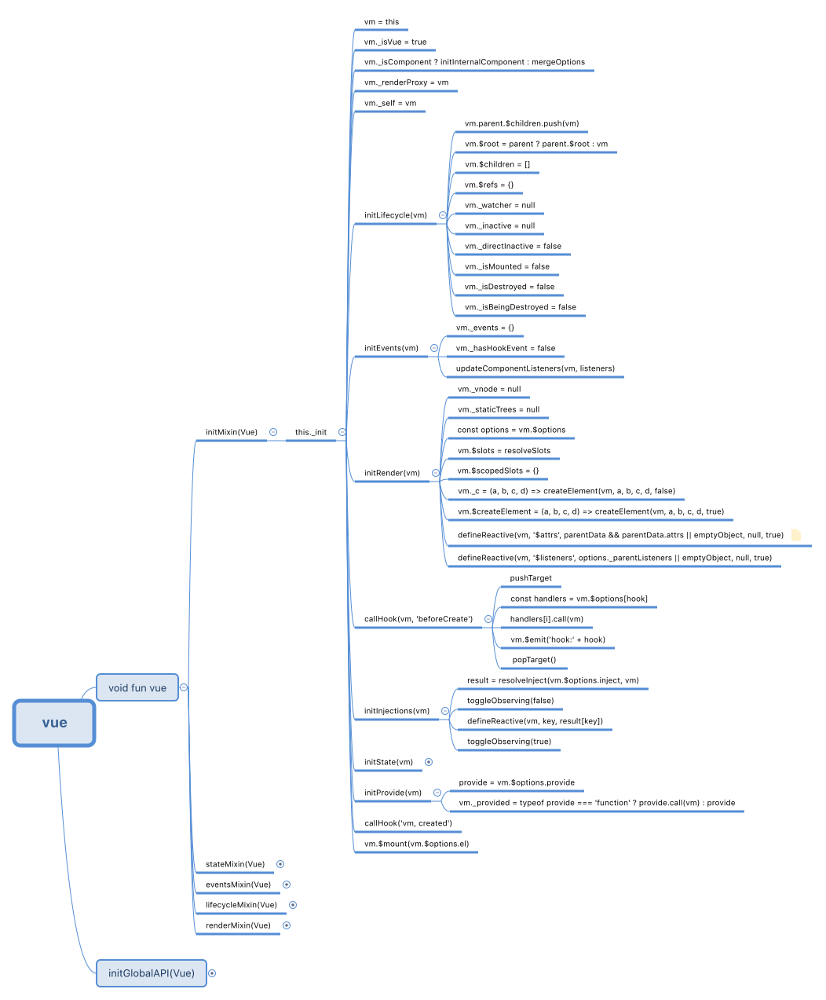

### 组件内部状态
现在我们已经知道，`vue._init()`大致的执行流程，那么其中的`state`到底是怎么实现的呢？

#### initProps
``` js
// core/instance/state.js
function initProps (vm: Component, propsOptions: Object) {
  // 传入的props对象
  const propsData = vm.$options.propsData || {}
  // props实际存储的位置，_props
  const props = vm._props = {}
  // 缓存prop键，以便将来的道具更新可以使用Array进行迭代而不是动态对象键枚举。
  const keys = vm.$options._propKeys = []
  const isRoot = !vm.$parent
  
  // 如果是根节点，那么不可观察
  if (!isRoot) {
    toggleObserving(false)
  }

  // 遍历propsData
  for (const key in propsOptions) {
    // 加入缓存
    keys.push(key)
    // 验证props的值,得到正确的值
    const value = validateProp(key, propsOptions, propsData, vm)

    // 数据劫持
    defineReactive(props, key, value)
    
    // 把props中的每一个值，代理到实例上
    if (!(key in vm)) {
      proxy(vm, `_props`, key)
    }
  }

  // 状态恢复
  toggleObserving(true)
}
```
从上面代码分析可以看出
* `props`的值在被验证之后，被挂载到内部变量`_props`中
* 设置可以通过`this`访问的`_props`代理

#### initMethods
``` js
function initMethods (vm: Component, methods: Object) {
  for (const key in methods) {
    vm[key] = methods[key] == null ? noop : bind(methods[key], vm)
  }
}
```
从上面代码分析可以看出
* 遍历methods中所有的方法
* 通过`bind`方法使得方法中`this`指向当前实例
* 把处理后的方法挂载到当前实例`(this)`

#### initData
``` js
function initData (vm: Component) {
  // 获取data选项
  let data = vm.$options.data
  
  // 获取data的指，并且赋值给_data
  data = vm._data = typeof data === 'function'
    ? getData(data, vm)
    : data || {}
  
  // 容错处理
  if (!isPlainObject(data)) {
    data = {}
  }
  // 获取所有的key
  const keys = Object.keys(data)
  let i = keys.length

  while (i--) {
    const key = keys[i]
    
    // 如果key不是以$或者_开头
    if (!isReserved(key)) {
      // 把_data中的每一个值，代理到实例上
      proxy(vm, `_data`, key)
    }
  }
  // 为data添加观察者
  observe(data, true)
}

export function getData (data: Function, vm: Component): any {
  // #7573 disable dep collection when invoking data getters
  pushTarget()
  try {
    // 执行data方法，这里的this指向实例
    return data.call(vm, vm)
  } catch (e) {
    handleError(e, vm, `data()`)
    return {}
  } finally {
    popTarget()
  }
}
```

从上面代码分析可以看出
* 首先获取了传入的`data`选项中的值，并且把值挂载到内部变量`_data`中
* 设置可以通过`this`访问的`_data`代理
* 通过调用`observe`来观察`data`中的值

#### initComputed
``` js
// 默认的配置
const computedWatcherOptions = { lazy: true }

function initComputed (vm: Component, computed: Object) {
  // 内部变量
  const watchers = vm._computedWatchers = Object.create(null)
  // 服务端渲染？
  const isSSR = isServerRendering()

  for (const key in computed) {
    // 用户穿入的值
    const userDef = computed[key]
    // 获取getter
    const getter = typeof userDef === 'function' ? userDef : userDef.get

    if (!isSSR) {
      // 每一个计算属性都将对应一个 watcher 实例
      watchers[key] = new Watcher(
        vm,
        getter || noop,
        noop,
        computedWatcherOptions
      )
    }

    // 定义计算属性
    if (!(key in vm)) {
      defineComputed(vm, key, userDef)
    }
  }
}

const sharedPropertyDefinition = {
  enumerable: true,
  configurable: true,
  get: noop,
  set: noop
}

export function defineComputed (
  target: any,
  key: string,
  userDef: Object | Function
) {
  // 如果不是服务端渲染，那么需要缓存
  const shouldCache = !isServerRendering()

  if (typeof userDef === 'function') {
    // 如果传入的是方法，那么包装
    sharedPropertyDefinition.get = shouldCache
      ? createComputedGetter(key)
      : userDef
    sharedPropertyDefinition.set = noop
  } else {
    // 如果传入的是对象，那么包装
    sharedPropertyDefinition.get = userDef.get
      ? shouldCache && userDef.cache !== false
        ? createComputedGetter(key)
        : userDef.get
      : noop
    sharedPropertyDefinition.set = userDef.set
      ? userDef.set
      : noop
  }
 
  // 把key代理到当前实例
  Object.defineProperty(target, key, sharedPropertyDefinition)
}

function createComputedGetter (key) {
  return function computedGetter () {
    // 获取对应的watcher
    const watcher = this._computedWatchers && this._computedWatchers[key]
    if (watcher) {
      // 懒监听
      if (watcher.dirty) {
        watcher.evaluate()
      }
      if (Dep.target) {
        // 添加依赖
        watcher.depend()
      }
      return watcher.value
    }
  }
}
```
* 定义内部变量`_computedWatchers`,
* 在`_computedWatchers`对象里面是`key`相对应的`watcher`实例,以便于收集`compute`中的依赖
* 把`computed`的`key`挂载到当前`vue`实例上

#### initWatch
* 直接调用`this.$watch`生成`watcher`实例
``` js
function initWatch (vm: Component, watch: Object) {
  for (const key in watch) {
    const handler = watch[key]
    if (Array.isArray(handler)) {
      for (let i = 0; i < handler.length; i++) {
        createWatcher(vm, key, handler[i])
      }
    } else {
      createWatcher(vm, key, handler)
    }
  }
}

function createWatcher (
  vm: Component,
  expOrFn: string | Function,
  handler: any,
  options?: Object
) {
  if (isPlainObject(handler)) {
    options = handler
    handler = handler.handler
  }
  if (typeof handler === 'string') {
    handler = vm[handler]
  }
  return vm.$watch(expOrFn, handler, options)
}
```

#### 问题
* 问题: 为什么`props`直接用了`defineReactive`，而`data`却用了`oberve`?  
  * `props`只是做了单个值的观察
  * `data`的只属性如果也是对象的话，也做了子属性值的数据观察

<!-- #### 思维导图
 -->