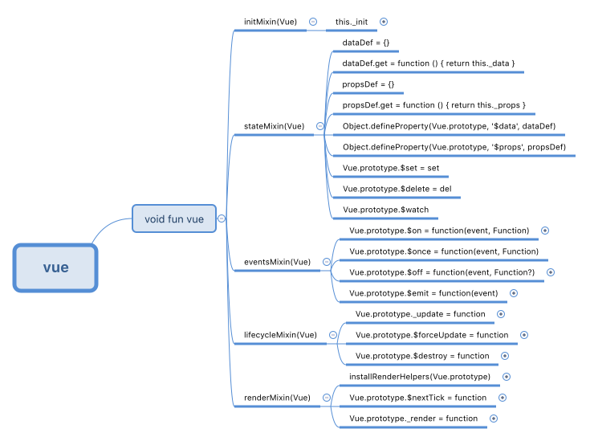

### vue是什么(一)？
官网文档上这样用
``` js
var app = new Vue({
    el: '#app',
    data: {
        message: 'Hello Vue!'
    }
})
```
从这段代码可以得知，`vue`本质上是一个构造函数，我们可以使用`new`关键字来声明一个`vue`实例。

#### 这个是个什么样子的构造函数？

``` js
// core/index.js

import Vue from './instance/index'
import { initGlobalAPI } from './global-api/index'

initGlobalAPI(Vue)

Vue.version = '__VERSION__'

export default Vue
```
可以看出，`vue`函数的定义是在`instance/index`这个文件下，`core`主模块只是对原`vue`函数添加了`GlobalAPI`以及一个`version`。所以`vue`函数的具体定义还需刨根问底。

``` js
// core/instance/index
function Vue (options) {
  this._init(options)
}

// 对vue函数的拓展
initMixin(Vue)
stateMixin(Vue)
eventsMixin(Vue)
lifecycleMixin(Vue)
renderMixin(Vue)

export default Vue
```
* 在这里可以看到`vue`函数的定义，以及当我们`new vue()`时实际上是调用了`thi._init(options)`。
* `vue`函数下执行的语句，则是对`vue`函数的各种拓展。也就是我们日常用到`vue`方法的实现！

#### initMixin(Vue)
那么，`this._init()`函数是在哪儿定义的？经验告诉我们，这个应该在这里`initMixin(Vue)`，那么去一探究竟。这里也是在执行`new vue`时的执行入口。现在先了解下大概，后续在详细讲解这里的具体实现。

``` js
export function initMixin (Vue: Class<Component>) {
  Vue.prototype._init = function (options?: Object) {
    // new vue() 时真正执行的方法
  }
}
```

#### stateMixin(Vue)
vue属性`$data,$props`的初始化，以及`$set,$delete,$watch`方法的拓展.

``` js
// core/instance/state
export function stateMixin (Vue: Class<Component>) {
  const dataDef = {}
  dataDef.get = function () { return this._data }
  const propsDef = {}
  propsDef.get = function () { return this._props }

  // 给vue添加拓展属性:$data,$props
  Object.defineProperty(Vue.prototype, '$data', dataDef)
  Object.defineProperty(Vue.prototype, '$props', propsDef)

  // 给vue添加拓展方法:$set,$delete
  Vue.prototype.$set = set
  Vue.prototype.$delete = del

  // 给vue添加拓展方法:$watch
  Vue.prototype.$watch = function (
    expOrFn: string | Function,
    cb: any,
    options?: Object
  ): Function {
    const vm: Component = this

    if (isPlainObject(cb)) {
      return createWatcher(vm, expOrFn, cb, options)
    }

    options = options || {}
    options.user = true

    const watcher = new Watcher(vm, expOrFn, cb, options)

    if (options.immediate) {
      cb.call(vm, watcher.value)
    }

    return function unwatchFn () {
      watcher.teardown()
    }
  }
}

function createWatcher (
  vm: Component,
  expOrFn: string | Function,
  handler: any,
  options?: Object
) {
  if (isPlainObject(handler)) {
    options = handler
    handler = handler.handler
  }
  if (typeof handler === 'string') {
    handler = vm[handler]
  }
  return vm.$watch(expOrFn, handler, options)
}
```


#### eventsMixin(Vue)
vue事件中，`$on,$once,$off,$emit`的定义。
``` js
// core/instance/event
export function eventsMixin (Vue: Class<Component>) {
  const hookRE = /^hook:/
  Vue.prototype.$on = function (event: string | Array<string>, fn: Function): Component {
    const vm: Component = this
    if (Array.isArray(event)) {
      for (let i = 0, l = event.length; i < l; i++) {
        this.$on(event[i], fn)
      }
    } else {
      (vm._events[event] || (vm._events[event] = [])).push(fn)
      // optimize hook:event cost by using a boolean flag marked at registration
      // instead of a hash lookup
      if (hookRE.test(event)) {
        vm._hasHookEvent = true
      }
    }
    return vm
  }

  Vue.prototype.$once = function (event: string, fn: Function): Component {
    const vm: Component = this
    function on () {
      vm.$off(event, on)
      fn.apply(vm, arguments)
    }
    on.fn = fn
    vm.$on(event, on)
    return vm
  }

  Vue.prototype.$off = function (event?: string | Array<string>, fn?: Function): Component {
    const vm: Component = this
    // all
    if (!arguments.length) {
      vm._events = Object.create(null)
      return vm
    }
    // array of events
    if (Array.isArray(event)) {
      for (let i = 0, l = event.length; i < l; i++) {
        this.$off(event[i], fn)
      }
      return vm
    }
    // specific event
    const cbs = vm._events[event]
    if (!cbs) {
      return vm
    }
    if (!fn) {
      vm._events[event] = null
      return vm
    }
    if (fn) {
      // specific handler
      let cb
      let i = cbs.length
      while (i--) {
        cb = cbs[i]
        if (cb === fn || cb.fn === fn) {
          cbs.splice(i, 1)
          break
        }
      }
    }
    return vm
  }

  Vue.prototype.$emit = function (event: string): Component {
    const vm: Component = this
    let cbs = vm._events[event]
    if (cbs) {
      cbs = cbs.length > 1 ? toArray(cbs) : cbs
      const args = toArray(arguments, 1)
      for (let i = 0, l = cbs.length; i < l; i++) {
        try {
          cbs[i].apply(vm, args)
        } catch (e) {
          handleError(e, vm, `event handler for "${event}"`)
        }
      }
    }
    return vm
  }
}
```
`events`的设计是这样的
* `vm._events`，是在`vue`初始化时生成的一个内部变量，这个变量是一个空对象(Object)
* `$on(name, fun)`方法时，会在`_events`写入`_events[name] = [fun]`
* `$once(name, fun)`和`$on`基本一直，只不过是传入的`fun`被包装过一次。
* `$off`,清空执行队列，或者移除队列中的函数
* `$emit`,执行`_events[name]`的事件队列。
  * 注意，这里指定了`this`指向
  * 注意，这里做了`try{}catch(){}`处理，以免函数被队列执行被阻塞


#### lifecycleMixin(Vue)
``` js
// core/instance/lifecycle
export function lifecycleMixin (Vue: Class<Component>) {
  // 拓展内部方法:_update
  Vue.prototype._update = function (vnode: VNode, hydrating?: boolean) {
    const vm: Component = this
    if (vm._isMounted) {
      // 触发 beforeUpdate 钩子
      callHook(vm, 'beforeUpdate')
    }
    const prevEl = vm.$el
    const prevVnode = vm._vnode
    const prevActiveInstance = activeInstance
    activeInstance = vm
    vm._vnode = vnode
    
    // 初始化节点或者更新节点
    if (!prevVnode) {
      vm.$el = vm.__patch__(
        vm.$el, vnode, hydrating, false,
        vm.$options._parentElm,
        vm.$options._refElm
      )
      vm.$options._parentElm = vm.$options._refElm = null
    } else {
      vm.$el = vm.__patch__(prevVnode, vnode)
    }
    activeInstance = prevActiveInstance

    if (prevEl) {
      prevEl.__vue__ = null
    }
    if (vm.$el) {
      vm.$el.__vue__ = vm
    }
    if (vm.$vnode && vm.$parent && vm.$vnode === vm.$parent._vnode) {
      vm.$parent.$el = vm.$el
    }
  }

  // 拓展方法:$forceUpdate
  Vue.prototype.$forceUpdate = function () {
    const vm: Component = this
    if (vm._watcher) {
      vm._watcher.update()
    }
  }

  // 拓展方法:$destroy
  Vue.prototype.$destroy = function () {
    const vm: Component = this
    if (vm._isBeingDestroyed) {
      return
    }
    
    // 触发钩子
    callHook(vm, 'beforeDestroy')
    vm._isBeingDestroyed = true
    
    // remove self from parent
    const parent = vm.$parent
    if (parent && !parent._isBeingDestroyed && !vm.$options.abstract) {
      remove(parent.$children, vm)
    }
    // teardown watchers
    if (vm._watcher) {
      vm._watcher.teardown()
    }
    let i = vm._watchers.length
    while (i--) {
      vm._watchers[i].teardown()
    }
    // remove reference from data ob
    // frozen object may not have observer.
    if (vm._data.__ob__) {
      vm._data.__ob__.vmCount--
    }
    // call the last hook...
    vm._isDestroyed = true
    // invoke destroy hooks on current rendered tree
    vm.__patch__(vm._vnode, null)
    // fire destroyed hook
    callHook(vm, 'destroyed')
    // turn off all instance listeners.
    vm.$off()
    // remove __vue__ reference
    if (vm.$el) {
      vm.$el.__vue__ = null
    }
    // release circular reference (#6759)
    if (vm.$vnode) {
      vm.$vnode.parent = null
    }
  }
}
```
#### renderMixin(Vue)

``` js
// core/instance/render
export function renderMixin (Vue: Class<Component>) {
  // install runtime convenience helpers
  installRenderHelpers(Vue.prototype)

  // 拓展方法：$nextTick
  Vue.prototype.$nextTick = function (fn: Function) {
    return nextTick(fn, this)
  }

  // 拓展内部方法：_render
  Vue.prototype._render = function (): VNode {
    const vm: Component = this
    const { render, _parentVnode } = vm.$options

    if (_parentVnode) {
      vm.$scopedSlots = _parentVnode.data.scopedSlots || emptyObject
    }

    // set parent vnode. this allows render functions to have access
    // to the data on the placeholder node.
    vm.$vnode = _parentVnode
    // render self
    let vnode
    try {
      vnode = render.call(vm._renderProxy, vm.$createElement)
    } catch (e) {
      handleError(e, vm, `render`)
      vnode = vm._vnode
    }
    // return empty vnode in case the render function errored out
    if (!(vnode instanceof VNode)) {
      vnode = createEmptyVNode()
    }
    // set parent
    vnode.parent = _parentVnode
    return vnode
  }
}
```

::: tip
注意：这些方法是挂载到`vue.prototype`上的  
在引入`vue`的[界面](https://cn.vuejs.org)，可以在控制台运行`Vue.prototype`来查看`vue`原型的属性和方法。
:::

#### 思维导图
