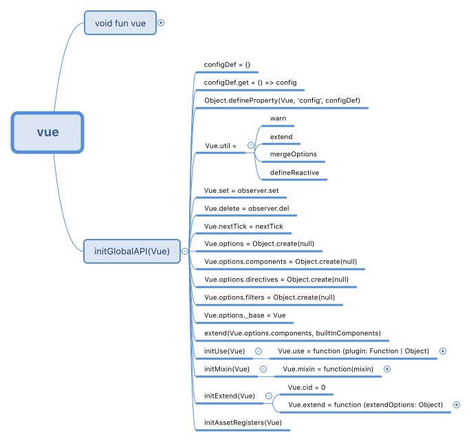

### vue是什么(二)？
上一章知道，`vue`本质上是一个构造函数，且大致捋了捋这个构造函数的一些方法。现在接着捋一捋这个构造函数的一些全局方法。

#### 全局函数注入的入口
``` js
// core/index.js
initGlobalAPI(Vue)
```

``` js
// core/global-api/index.js
export function initGlobalAPI (Vue: GlobalAPI) {
  // config
  const configDef = {}
  configDef.get = () => config
  Object.defineProperty(Vue, 'config', configDef)

  // 内部使用的工具类方法
  Vue.util = {
    warn,
    extend,
    mergeOptions,
    defineReactive
  }

  // 方法拓展
  Vue.set = set
  Vue.delete = del
  Vue.nextTick = nextTick

  // 属性拓展
  Vue.options = Object.create(null)

  // 定义options下的'components','directives','filters'为空对象
  ASSET_TYPES.forEach(type => {
    Vue.options[type + 's'] = Object.create(null)
  })

  // 属性拓展
  Vue.options._base = Vue

  // 使得当前的components，继承keep-alive组件
  extend(Vue.options.components, builtInComponents)

  initUse(Vue)
  initMixin(Vue)
  initExtend(Vue)
  initAssetRegisters(Vue)
}
```

#### initUse
``` js
// core/global-api/use.js
export function initUse (Vue: GlobalAPI) {
  // use方法的暴露
  Vue.use = function (plugin: Function | Object) {
    const installedPlugins = (this._installedPlugins || (this._installedPlugins = []))
    if (installedPlugins.indexOf(plugin) > -1) {
      return this
    }

    // additional parameters
    const args = toArray(arguments, 1)
    args.unshift(this)
    // 执行install或者plugin
    if (typeof plugin.install === 'function') {
      plugin.install.apply(plugin, args)
    } else if (typeof plugin === 'function') {
      plugin.apply(null, args)
    }
    // 缓存
    installedPlugins.push(plugin)
    return this
  }
}
```

#### initMixin
``` js
// core/global-api/mixin.js
export function initMixin (Vue: GlobalAPI) {
  Vue.mixin = function (mixin: Object) {
    this.options = mergeOptions(this.options, mixin)
    return this
  }
}
```

#### initExtend
``` js
// core/global-api/extend.js
export function initExtend (Vue: GlobalAPI) {

  Vue.cid = 0
  let cid = 1

  Vue.extend = function (extendOptions: Object): Function {
    extendOptions = extendOptions || {}
    // this指，vue构造函数，而不是实例
    const Super = this
    const SuperId = Super.cid
    const cachedCtors = extendOptions._Ctor || (extendOptions._Ctor = {})

    // 缓存
    if (cachedCtors[SuperId]) {
      return cachedCtors[SuperId]
    }

    const name = extendOptions.name || Super.options.name

    // 子类
    const Sub = function VueComponent (options) {
      this._init(options)
    }

    // 原型继承
    Sub.prototype = Object.create(Super.prototype)
    Sub.prototype.constructor = Sub

    // 维护cid
    Sub.cid = cid++
    // 合并options
    Sub.options = mergeOptions(
      Super.options,
      extendOptions
    )
    Sub['super'] = Super

    // 初始化props和computed
    if (Sub.options.props) {
      initProps(Sub)
    }
    if (Sub.options.computed) {
      initComputed(Sub)
    }

    // 全局方法的继承
    Sub.extend = Super.extend
    Sub.mixin = Super.mixin
    Sub.use = Super.use

    // 继承父类的'components','directives','filters'
    ASSET_TYPES.forEach(function (type) {
      Sub[type] = Super[type]
    })
    // enable recursive self-lookup
    if (name) {
      Sub.options.components[name] = Sub
    }

    Sub.superOptions = Super.options
    Sub.extendOptions = extendOptions
    Sub.sealedOptions = extend({}, Sub.options)

    // 加入缓存
    cachedCtors[SuperId] = Sub

    // 返回构造函数
    return Sub
  }
}

function initProps (Comp) {
  const props = Comp.options.props
  for (const key in props) {
    proxy(Comp.prototype, `_props`, key)
  }
}

function initComputed (Comp) {
  const computed = Comp.options.computed
  for (const key in computed) {
    defineComputed(Comp.prototype, key, computed[key])
  }
}
```

#### initAssetRegisters
``` js
// core/global-api/assets.js

export function initAssetRegisters (Vue: GlobalAPI) {
  /*
  * 注册全局方法
  * ASSET_TYPES = ['component','directive','filter']
  * */
  ASSET_TYPES.forEach(type => {
    Vue[type] = function (
      id: string,
      definition: Function | Object
    ): Function | Object | void {
      if (!definition) {
        return this.options[type + 's'][id]
      } else {
        if (type === 'component' && isPlainObject(definition)) {
          definition.name = definition.name || id
          definition = this.options._base.extend(definition)
        }
        if (type === 'directive' && typeof definition === 'function') {
          definition = { bind: definition, update: definition }
        }
        this.options[type + 's'][id] = definition
        return definition
      }
    }
  })
}

```
::: tip
注意：这些方法是直接挂载到`vue`这个构造函数上的，而不是原型`(prototype)`  
在引入`vue`的[界面](https://cn.vuejs.org)，可以在控制台运行`Object.keys(Vue)`来查看`vue`函数的全局属性和方法。
:::

#### 思维导图
